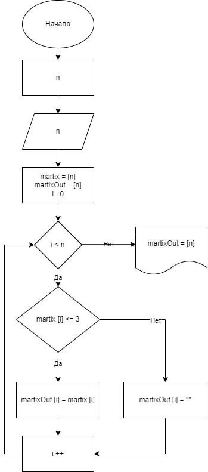

# MagicStrings
## Итоговая работа GB

Из имеющегося массива строк сформировать массив строк, длина которых меньше либо равна 3 символам.
## Решение
Создаем массив строк случайной длины со случайным набором символов.
Максимальная длина строк и их количество в массиве задаются пользователем.

Блок-схема алгоритма:

### Описание работы алгоритма основного блока программы
1. Запрашиваем у пользователя количество строк массива и макимальную длину строки.
---
	Console.WriteLine("Введите количество строк массива: ");
	int strCount = Convert.ToInt32(Console.ReadLine());
	Console.WriteLine("Введите максимальное количество символов строки в массиве: ");
	int maxLength = Convert.ToInt32(Console.ReadLine());

2. Создаем массив строк случайной длины и со случайным набором символов вызовом метода GetArray
---
	string[] matrix = GetArray(maxLength, strCount);

3. Выводим на экран полученный массив.
---
	Console.WriteLine("Строки с количеством символов не больше 3: ");
	var result = resMatrix.Where(x => !string.IsNullOrWhiteSpace(x));
	Console.WriteLine(String.Join(",", result));

4. Объявляем новый массив, который будет формироваться из строк длиной не более 3 символов.
---
	string[] resMatrix = new string[strCount];

5. Формируем новый массив строками длиной не более 3 символов из начального массива.
---
	for (int i = 0; i < strCount; i++)
	{
		if (matrix[i].Length <= 3)
		{
			resMatrix[i] = matrix[i];
		}
	}

6. Удаляем пустые строки массива
---
	var result = resMatrix.Where(x => !string.IsNullOrWhiteSpace(x));

7. Выводим в консоль полученный массив строк
---
	Console.WriteLine("Строки с количеством символов не больше 3: ");
	var result = resMatrix.Where(x => !string.IsNullOrWhiteSpace(x));
	Console.WriteLine(String.Join(",", result));
